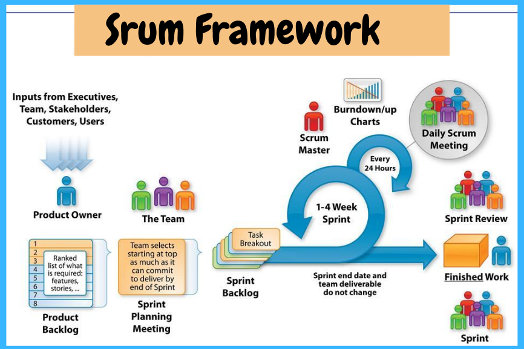
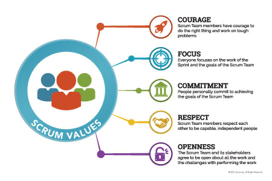
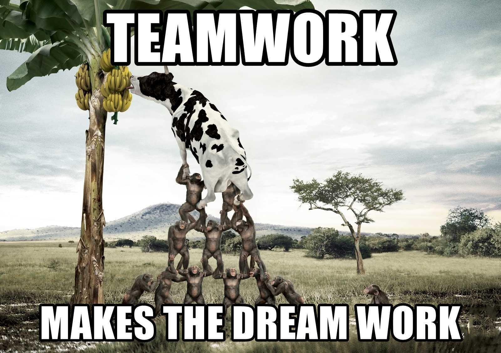
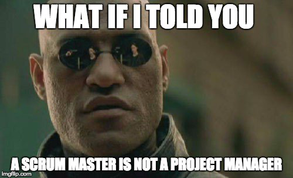
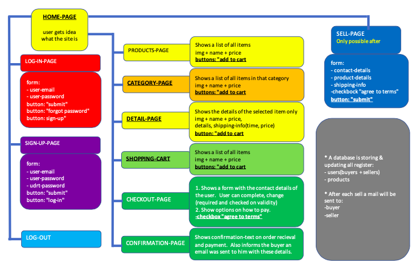
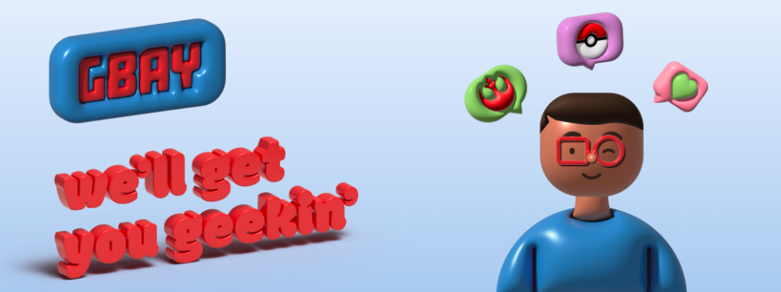

# E-commerce-webshop

creating an ecommerce website  requiring front-end as well as back-end,
is THE biggest assignment we had so far.  (It was only a few months ago, we started from 0.)
We are working in team on a very-close-to-reality-challenge.

## The Mission:
We have gotten a request to make a website for a client. The client had a bit and a lot to say
about it, but basically it boils down to a web-shop / ebay kind of thing.  

We are for the first time ever, working with SCRUM.

### SCRUM:
Encourages teams to learn through experiences, self-organize while working on a problem, 
and reflect on their wins and losses to continuously improve.


#### Advantages of Scrum:
- Scrum can help teams complete project deliverables quickly and efficiently
- Scrum ensures effective use of time and money 
- Large projects are divided into easily manageable sprints 
- Developments are coded and tested during the sprint review 
- Works well for fast-moving development projects 
- The team gets clear visibility through scrum meetings 
- Scrum, being agile, adopts feedback from customers and stakeholders 
- Short sprints enable changes based on feedback a lot more easily 
- The individual effort of each team member is visible during daily scrum meetings

#### Disadvantages of Scrum:
- Scrum often leads to scope creep, due to the lack of a definite end-date
- The chances of project failure are high if individuals aren't very committed or cooperative 
- Adopting the Scrum framework in large teams is challenging 
- The framework can be successful only with experienced team members 
- Daily meetings sometimes frustrate team members 
- If any team member leaves in the middle of a project, it can have a huge negative impact on the project 
- Quality is hard to implement until the team goes through an aggressive testing process

### The client:
Played by our coaches.  Yes, they did a personality-split.  Can't ask the coach 
what the client wants or the other way around.
```
"WE WANT: 
    - a website like eBay but for geekie stuff with different categories, lik Pokemon, Dragonball,...
    - Every user can buy and sell.
    - Their is an option to Login and Logout.
    - Emails will be sent to communicate progress of orders: bought & sold.
    - Currency and delivery is only in Belgium + it's the sellers responsibility to add prices for delivery.
    - There is a Shopping cart.

IT WOULD BE NICE TO HAVE:
    - A list of Similar products when the user clicks an item.(recommended)
    - Maybe the users can add items to a wishlist?
    - A purchase history and/or a price history.
    - The buyer will automatically get 'website currency' for every purchase or sell.  With this currency,
    only certain items from the platform can be bought.
    - Extra pages: About us, contact us, delivery, privacy, ….

HOW WE WANT IT TO LOOK LIKE:
    - Not like bol.com, thats way too dry.
    - Lifely interactions colours animations, please"
```

### The team:
    Wendy - Scrum- master + Front-end
    Mo - Full-stack
    Zeno - Full-stack
    Snehal - Full-stack
    Vlad - Front-end

## THE ACTUAL TEAM-WORK:



We started by having our very first stand-up meeting.  Yes!!!! we can do this, what is our approach?, 
which languages are we going to use? who wants to do what (front- back-end or both)?

    - PHP
    - SQL
    - REACT
    - TAILWIND

Scrum is all about working in team, communicating, making decisions together.  And that went well wright from
the start.  It was clear which features were important.  Ideas started popping up in our minds. And with that,
we started to create our SCRUM-board.

For this I opted to use kanbantool.com.  Normally you need to pay for it, but they have a 2-week trial.  Just the time we need it.
I can recommend this tool as it is easy to use, and what I really liked, at the end of the day I always received an email
that would show me a summary of what was done, by whom, over which period of time.

STORIES:

- User visits the site to see what its about/buy/sell.
- User logs-in to access his account.
- User signs-up to create his own account.
- User clicks on an item because he wants to see more details.
- User clicks "add to cart", to see/change/buy all items added to the cart.
- User clicks "checkout" because he wants to finalise the purchase.
- User clicks "sell" because he wants to add items for sale. 

FROM THERE ON OUT:
- Break the stories down until tickets were ready for the take.  Boy-oh-Boy, the list was long.  
With an optimistic team, like ours, that was a good thingy.
- I, as the SCRUM master did some research to find out what my responsibilities were:



 - Hold daily stand-up meetings in the morning: how is everybody feeling, what is who's plan for today, estimations,..
 - Keeping my team safe: from themselves (not going further than needed), from each other, from the client.
 - Keeping them motivated and optimistic, make sure they were not afraid to communicate.
 - Control the SCRUM-board.
 - Keep in contact with the client.
 - Keep contact with superiors.
 - Plan sprint-meetings.
 - Bring croissants to keep their stumach happy.

So I sent out our first e-mail to the clients, with MVP, to confirm them, we understood their wishes, ask for some more details.


- Meanwhile, a folder-structure was set up and Mo, Snehal and Zeno started working on creating our database.
the most important thing, because we need to store our users-data + products-data in order to create a functional web-shop.
So, this is our skeleton.  And it needs to be strong & steady.
- Since we decided to work with Tailwind and React, research needed to be done on how these 2 work together.
- Another thing to find out was: How to make the connection between front- and back-end.
- We came to the conclusion that finishing a first and complete story... was not really near.
- Zeno our 3D-champ, created a damn nice logo and header:



- Because the client was coming to visit soon, we needed to prioritize the look first.  It just wouldn't make
sense to them if we couldn't show them anything but a database.  Honestly, the user, nor the client, doesn't really
care or think about that.  So we created pages (just the look only):
    - Home
    - Log-in
    - Sign-up
    - Detail
    - Cart
    - Checkout
- Then it was time to show the client we have not been sitting still.  We showed our pages with pride.
He was with us only for a short period of time.  There were no real comments.  Only the question "Do you think all this
will be functional on time?"  My answer: "I sure hope so, I believe in my team!  But, I cannot make that promise, there
can always be unforeseen circumstances."  That seemed to be accepted.  Our client was really not that difficult.  As I was
doing my SCRUM-research, it seemed to be important to make changes at all times.  And knowing our coaches, we 
expected just that.  He did speak about a platform currency.  And our Mo came up with the idea to call it: "Schmeckles".

- After we had another team-meeting, in which we decided to leave the Schmeckles for now to make sure that the 
priorities are handled first.  

- Mo is doing the back-end logic + login + sign-up.
- Snehal is doing the back-end by creating a products-form to make sure new products can be inserted in the database and make sure they can be displayed. 
- Zeno is working on the category-page as we urgently need a Nav-bar... he is also taking that to his account. 
- I work on the functionality of the cart-page in which the user can delete items, change the quantity, the price will be updated and 
user proceeds to checkout.


- Next, we arrive at our Sprint.  I prepared some questions for the team, to think and talk about.  This way they understood what
a sprint is all about.
    - How are you doing?
    - What went well?
    - What didn't go well?
    - What could be improved and how?
    - Is it realistic to finish the stories by the delivery-date?
    - What is absolute priority?
    - ...
It was, in my opinion an interesting meeting in which we could order tickets according their importance.
Priority would now be displaying the products, the functionality of the "add to cart"-button, completing the checkout 
and finalizing payment, log-in and log-out, seller-page.  

Everybody likes working with tickets. It works motivational to see the list of tickets, in the done-column grow.

Things went slower than we all wanted them to go.  We went over the estimated times.
But that's fine.  I made clear in the beginning, these were estimations and not deadlines.
I know for a fact we are all working hard.

Everybody seems to agree, that communication is going really well.

There is still optimism to be found on finishing everything in time.  Although wanting to accomplish and being able to do so,
are 2 different things.  Time will tell.

- and we continue working our tickets, and preparing the pages for inputs from the database so products can
be displayed. Before we know it, its friday week 2, when the coach says "2 more days people".

Time to write the readme, and finish the tickets we are working on.  Another email is being sent to the client
to update the changes that were made this week along with a request to consider giving us extra time.  

Cinderella wanted extra time, but 12 o'clock was 12 o'clock.  The same goes for our clients, not back to beiing coach in time, might
turn them into couches.  And then we wil no longer take this course, but a curse.


## LOOKING BACK:
### Wendy: SCRUM-master + front-end
```
I am proud of my team!  We worked damn hard, commucicated really well and realised nice things.  The most important,
we all learned a lot.  Pushing and pulling went really smooth:  a message was sent out every time when pulling needed to be 
done.  

We bumped our heads, a few times, here and there, which consumed more time then expected.  It never feels 
good at first, but then after we crawled up again and realized it's good to bump! Those are the moments when the "magic" 
happens and real learning is done.

If I really have to give a comment: At times we ran a bit ahead of ourselves, dreams were big and we hoped we had time on
our side. Even though we agreed things like a wishlist or ratings, were not a must, preparations for them were partly made.  
Due to not a must and lack of time, these needed to be commented for the client.  
```

### Mo: Full-stack 
```
your tekst here Moke!
```

### Zeno: Full-stack
```
I'm happy with how the team did. Personally I found I could have done better. Because of personal stuff I couldn't really focus 
the full 100%. This is not fair to the team but it's not always easy to not think about private matters. This for me slowed
down my work. I loved creating the database with Mo and Snehal. Afterwards I made a logo and header, we wanted 3D but 
lost a lot of time with the rendering (old computer). Afterwards I had some issues connecting to the database, frustrated me a lot.
Eventually it was a path issue, even more frustrating. I felt like we did our best, but personally I didn't feel like I was 
able to use my full potential for this project. I found the communication at the beginning lacking, we where all shouting through eachother
not a lot of structure. This improved a lot in the days we worked more on the project, but it also cost us a lot of time. We also 
lost time because certain components had to be re-made.

None the less it was a good learning experience and I'm happy I had the opportunity to work with other classmates I hadn't worked with yet.
I'm proud of you all, and you're all kicking web dev ass. Keep up the work!
```

### Snehal
```
your tekst here Snehalleke!
```
  


    


